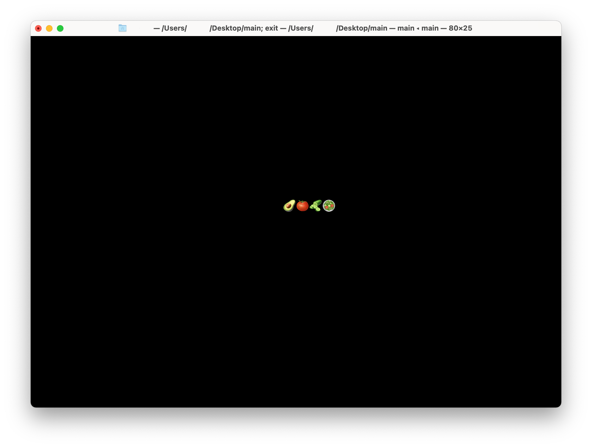
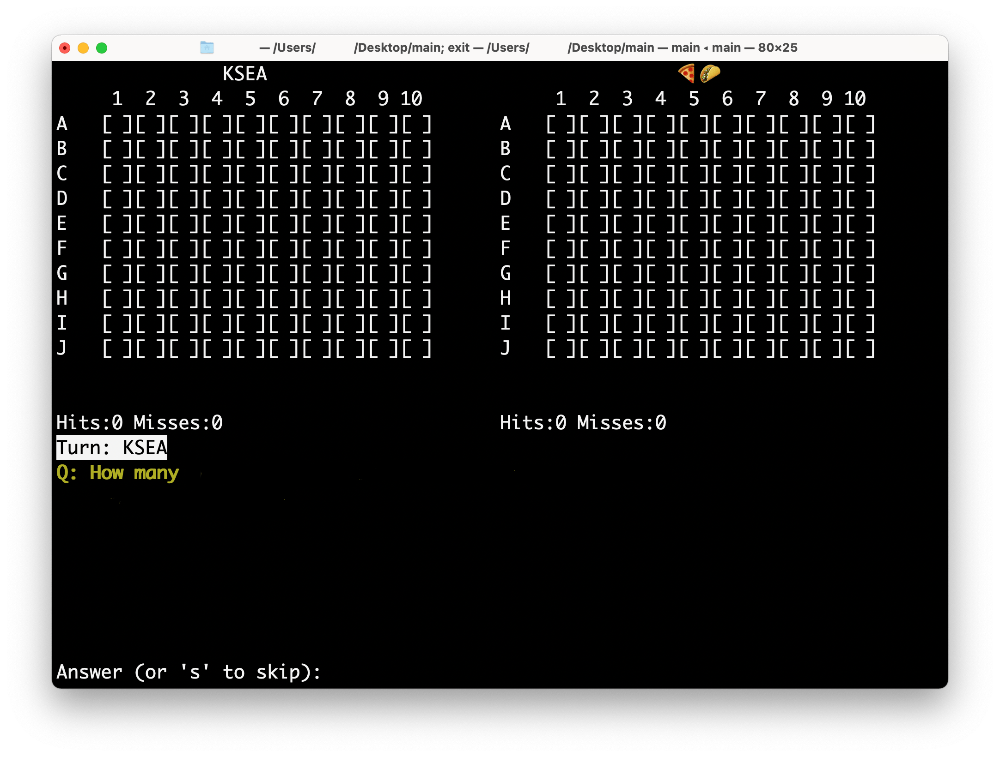

This is a Battleship game generated by gpt and fine tuned with chatgpt and a bit of my brainpower.

The sole purpose of this thing is to build a game for my homeroom for the chapel presentation, and I totally do not have time to learn python whatsoever.
sorry if the whole gpt thing makes you uncomfortable! :(

btw it is due 6 May 2025 lol

The screen size has to be at least **`77x25`** lines for the program to function normally

Compiled using pyinstaller `--onefile` option

---
~~The Q&A formatter, unfortunately, is written by gpt as well lol.~~
~~The input format is:~~\
\
~~Question (1 line)~~\~~
~~A) answer1~~\
~~B) answer2~~\
~~C) answer3~~\
~~D) answer4~~\
~~Answer: real answer goes here~~\
\
~~or,~~\
\
~~Question (1 line)~~\
~~Answer: True (or false)~~\

------------
\
\

------------
Not taking anything politically or anything that sort of stuff. Questions came up by people in the homeroom, and I have absolutely no responsibility in fact checking and stuff! I just write this thing for the homeroom!
sorry for the terrible names I came up with these files lol
